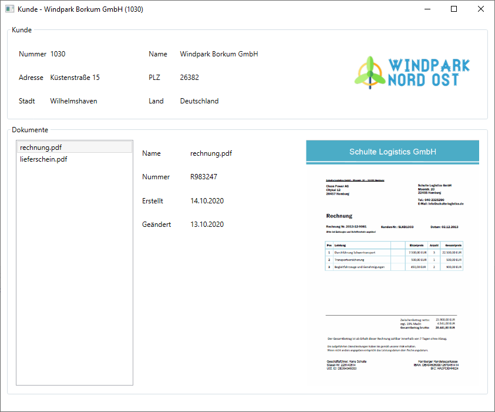

# abc-crm
This is an AMAGNO Web API example project with .NET Core and RestSharp

# Usage
* Edit [RestSharpCustomerDocumentRepository.cs](src/Abc.Crm.WindowsClient/Repository/RestSharpCustomerDocumentRepository.cs) so that the data fits to your environment. You can also create a new derived type of ICustomerDocumentRepository and implement the API methods yourself.
* Change the SimpleIoc configuration in [ViewModelLocator.cs](src/Abc.Crm.WindowsClient/Service/ViewModelLocator.cs) to use the your implementation of ICustomerDocumentRepository.
